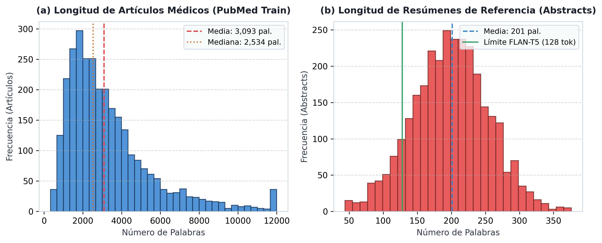
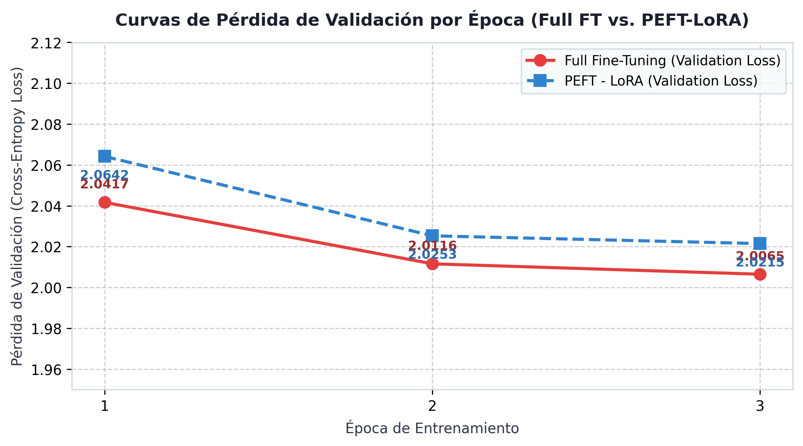
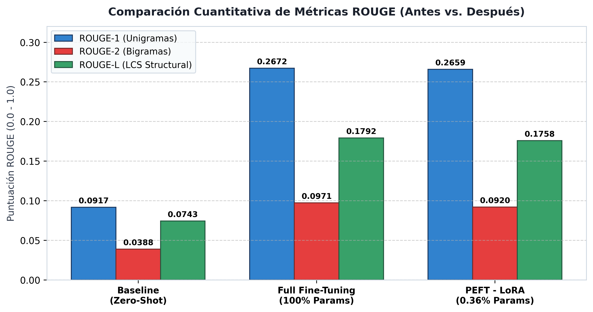

# Ajuste Fino (Fine-Tuning) Eficiente (LoRA) de FLAN-T5-Base para el Resumen de Literatura Médica (PubMed)

[](https://colab.research.google.com/drive/1K9NLVWaocCAxy5q0p7aDA23LgRnfwfH4?usp=sharing)
[](docs/informe_grupo1_p2.pdf)

> **Proyecto de Investigación y Réplica — Segundo Parcial**  
> **Asignatura:** Redes Neuronales y Aprendizaje Profundo (CDDEIA-ELNO-6-2)  
> **Universidad de Guayaquil — Carrera de Ciencias de Datos e Inteligencia Artificial**  
> **Grupo 1:** Alvarez Roberto, Carlos Jeancarlos, Intriago Jorge, Menoscal Julleysi, Remache Valeria  

---

## Paper de Referencia

* **Título:** *Parameter-Efficient Fine-Tuning for Medical Text Summarization: A Comparative Study of LoRA, Prompt Tuning, and Full Fine-Tuning*
* **Autores:** Ulugbek Shernazarov, Rostislav Svitsov, Bin Shi (2026)
* **Publicación:** *Computer Science & Information Technology (CS & IT)*, 16(06), 01–09.
* **Citas / Identificadores:** [DOI: 10.5121/csit.2026.160601](https://doi.org/10.5121/csit.2026.160601) · [arXiv: 2603.21970](https://arxiv.org/abs/2603.21970)

---

## 📂 Estructura Oficial del Repositorio 

```text
.
├── notebook_grupo1_p2.ipynb            # Notebook principal ejecutable (Google Colab GPU T4)
├── requirements.txt                    # Dependencias oficiales de Python
├── .gitignore                          # Filtro de temporales, checkpoints y archivos pesados (>50MB)
├── README.md                           # Presentación oficial del repositorio en GitHub
└── docs/                               # Carpeta de entregables oficial
    ├── informe_grupo1_p2.pdf           # Informe Académico Oficial en PDF (Norma APA 7)
    └── pics/                           # Subcarpeta de imágenes y figuras oficiales
        ├── figura1_eda_pubmed.png      # Figura 1: Análisis Exploratorio de Datos (EDA)
        ├── figura2_curvas_perdida.png  # Figura 2: Curvas de Pérdida de Validación
        └── figura3_comparacion_rouge.png # Figura 3: Comparación Cuantitativa ROUGE
```

---

## Galería de Resultados Gráficos

### Figura 1: Análisis Exploratorio de Datos (EDA) del Dataset PubMed

*Distribución log-normal de longitud de artículos (promedio 3,093 palabras) vs. resúmenes de referencia (promedio 201 palabras).*

### Figura 2: Curvas de Pérdida de Validación por Época

*Trayectoria de aprendizaje convergente entre Full Fine-Tuning (2.0417 -> 2.0065) y PEFT-LoRA (2.0642 -> 2.0215).*

### Figura 3: Comparación Cuantitativa de Métricas ROUGE

*Salto cuantitativo del Baseline Zero-Shot (0.0917) frente a LoRA (0.2659) y Full Fine-Tuning (0.2672).*

---

## Resultados Cuantitativos Comparativos

| Estrategia | Parámetros Entrenables | % Params | ROUGE-1 | ROUGE-2 | ROUGE-L | VRAM Consumida | Tiempo de Entren. |
| :--- | :---: | :---: | :---: | :---: | :---: | :---: | :---: |
| **Baseline (Zero-Shot)** | 0 | 0.0% | 0.0917 | 0.0388 | 0.0743 | ~4.2 GB | N/A |
| **Full Fine-Tuning** | 248,462,592 | 100.0% | 0.2672 | 0.0971 | 0.1792 | ~14.5 GB | 38.3 min |
| **PEFT - LoRA (Nuestro)** | **884,736** | **0.36%** | **0.2659** | **0.0920** | **0.1758** | **~6.8 GB** | **23.8 min** |

---

## Contenido del Notebook (`notebook_grupo1_p2.ipynb`)

1. **1 — Paper y Problema:** Resumen de Shernazarov et al. (2026), justificación de la réplica y estrategia PEFT.
2. **2 — Dataset y EDA:** Carga de `ccdv/pubmed-summarization`, tokenización y gráficos de distribución de palabras.
3. **3 — Implementación de la Adaptación:** Carga del modelo base `google/flan-t5-base`, inyección de LoRA ($r=8, \alpha=16$) en proyecciones `q` y `v` (0.36% parámetros).
4. **4 — Evaluación: Antes y Después:** Evaluación cuantitativa de Baseline Zero-Shot vs Full Fine-Tuning vs PEFT-LoRA, curvas de loss y muestras cualitativas (#0, #10, #25).
5. **5 — Análisis Crítico:** Explicación matemática de prevención de sobreajuste, límites de secuencia y propuesta de QLoRA/AdaLoRA.
6. **6 — Conclusiones:** Réplica exitosa, viabilidad en GPU Colab T4 con solución de estabilidad `fp32` y acumulación de gradientes.

---

## Limitaciones Técnicas y Diagnóstico de Hardware

* **Diagnóstico de Precisión `fp32`:** FLAN-T5 fue pre-entrenado en `bfloat16`. Al ejecutarlo en la GPU Tesla T4 de Colab (sin soporte de hardware para `bfloat16`), la precisión `fp16` producía errores de desbordamiento (`NaN`). Se solucionó forzando `fp16=False` (`fp32`) y usando acumulación de gradientes para mantener un lote efectivo de 16.
* **Propuestas de Mejora:** Integración de **QLoRA** a 4 bits (NF4) y asignación de rango dinámico (**AdaLoRA**) para permitir la adaptación de modelos de mayor escala como FLAN-T5-Large (770M).

---

## Declaración de Uso de IA

Partes del código del notebook y de la redacción del informe fueron desarrolladas con asistencia de herramientas de IA generativa para el formateo sintáctico y la auditoría metodológica.

---
*Universidad de Guayaquil — Facultad de Ciencias Matemáticas y Físicas — CDDEIA 2026*
